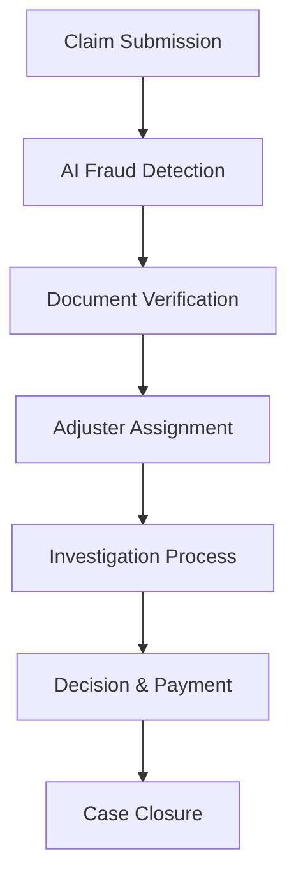

# AI-Driven Personalized Insurance Underwriting Platform
## Implementation Plan & Roadmap

### Executive Summary

This document outlines a comprehensive implementation plan for enhancing the AI-Driven Personalized Insurance Underwriting Platform. The plan focuses on transforming the current prototype into a production-ready, scalable solution that delivers exceptional user experience while maintaining regulatory compliance and business objectives.

---

## Current Platform Status

### ✅ Completed Features
- **User Authentication**: Hybrid Clerk + Supabase authentication system
- **Comprehensive Questionnaire**: Multi-step assessment covering demographics, health, lifestyle, and financial data
- **AI Risk Assessment**: Basic risk scoring and premium calculation
- **Dashboard Interface**: User dashboard with policy management, assessments, and insights
- **Database Integration**: Supabase backend with proper RLS policies
- **Responsive Design**: Mobile-friendly interface with modern UI/UX

### 🔧 Current Architecture
- **Frontend**: React 18.3.1 + TypeScript + Tailwind CSS
- **Backend**: Supabase (PostgreSQL + Auth + Edge Functions)
- **Authentication**: Clerk (OAuth) + Supabase (Email/Password)
- **Deployment**: Vite build system with Netlify hosting
- **State Management**: React hooks with local state

---

## Phase 1: Foundation & Core Enhancements (Weeks 1-4)

### 1.1 Immediate Prioritization

#### High-Impact Features (Week 1-2)
- **Dynamic Risk Adjustment System**
  - Real-time risk score updates based on user data changes
  - Automated premium recalculation triggers
  - User notification system for risk score changes
  - Impact: Improved accuracy, user engagement, competitive advantage

- **Multi-Factor Authentication (MFA)**
  - TOTP authenticator app support
  - SMS verification backup
  - Biometric authentication (Face ID/Touch ID)
  - Impact: Enhanced security, regulatory compliance

- **Enhanced Error Handling & Logging**
  - Comprehensive client-side error boundaries
  - Server-side error tracking with Sentry integration
  - User-friendly error messages and recovery flows
  - Impact: Improved reliability, better user experience

#### Medium-Impact Features (Week 3-4)
- **Document Management System**
  - Secure file upload with encryption
  - OCR integration for automatic data extraction
  - Document categorization and search
  - Impact: Streamlined user onboarding, reduced manual data entry

- **Payment Gateway Integration**
  - Stripe integration for premium payments
  - Auto-pay setup and management
  - Payment history and receipts
  - Impact: Revenue generation, user convenience

### 1.2 User Feedback & Metrics Analysis

#### Data Collection Strategy
```typescript
// Analytics tracking implementation
interface UserAnalytics {
  questionnaire_completion_rate: number;
  average_session_duration: number;
  feature_usage_metrics: Record<string, number>;
  user_satisfaction_scores: number[];
  support_ticket_categories: Record<string, number>;
}
```

#### Key Metrics to Track
- Questionnaire completion rates by step
- Time spent on each assessment section
- Dashboard feature engagement
- User drop-off points
- Support request patterns

### 1.3 Compliance Alignment

#### Regulatory Requirements
- **GDPR Compliance**: Data portability, right to deletion, consent management
- **HIPAA Compliance**: Health data encryption, access controls, audit trails
- **SOC 2 Type II**: Security controls, availability, confidentiality
- **State Insurance Regulations**: Vary by jurisdiction, require legal review

#### Implementation Checklist
- [ ] Data encryption at rest and in transit
- [ ] Comprehensive audit logging
- [ ] User consent management system
- [ ] Data retention and deletion policies
- [ ] Regular security assessments

---

## Phase 2: Advanced AI & Personalization (Weeks 5-8)

### 2.1 Continuous Underwriting System

#### Technical Architecture
```typescript
// Continuous risk monitoring service
class ContinuousUnderwritingService {
  async monitorRiskFactors(userId: string): Promise<RiskUpdate> {
    // Monitor health data from wearables
    // Track financial changes
    // Analyze lifestyle patterns
    // Calculate risk score adjustments
  }
  
  async triggerReassessment(userId: string, trigger: RiskTrigger): Promise<void> {
    // Automatic reassessment based on significant changes
    // User notification of changes
    // Premium adjustment calculations
  }
}
```

#### Implementation Components
- **Real-time Data Ingestion**: APIs for health trackers, financial apps
- **Risk Monitoring Engine**: Background jobs to analyze data changes
- **Notification System**: Email, SMS, push notifications for risk updates
- **Premium Adjustment Workflow**: Automated recalculation with user approval

### 2.2 Predictive Analytics & Insights

#### AI Model Enhancements
```python
# Enhanced ML pipeline for predictive insights
class PredictiveInsightsEngine:
    def __init__(self):
        self.models = {
            'churn_prediction': ChurnPredictionModel(),
            'health_trend_analysis': HealthTrendModel(),
            'financial_risk_assessment': FinancialRiskModel(),
            'life_event_prediction': LifeEventModel()
        }
    
    def generate_insights(self, user_data: UserProfile) -> List[Insight]:
        # Generate personalized insights
        # Predict future needs
        # Recommend actions
        pass
```

#### Insight Categories
- **Health Predictions**: Early warning for potential health issues
- **Financial Forecasting**: Income stability, debt management insights
- **Life Event Anticipation**: Marriage, children, home purchase predictions
- **Policy Optimization**: Coverage gap analysis, cost optimization

### 2.3 Interactive Scenario Analysis

#### "What-If" Calculator Features
- **Health Scenario Modeling**: Impact of lifestyle changes on premiums
- **Financial Planning**: Coverage needs based on life changes
- **Risk Mitigation**: Cost-benefit analysis of risk reduction strategies
- **Policy Comparison**: Side-by-side analysis of different coverage options

---

## Phase 3: Core Insurance Functionality (Weeks 9-12)

### 3.1 Comprehensive Policy Management

#### Policy Lifecycle Management
```typescript
interface PolicyManagement {
  policy_creation: PolicyCreationWorkflow;
  policy_modifications: PolicyModificationService;
  renewal_management: RenewalAutomationService;
  cancellation_process: PolicyCancellationWorkflow;
}
```

#### Features to Implement
- **Policy Comparison Tool**: Side-by-side feature and cost comparison
- **Coverage Calculator**: Interactive tools for determining optimal coverage
- **Beneficiary Management**: Easy updates with legal validation
- **Policy Document Generation**: Automated policy document creation

### 3.2 Advanced Claims Processing

#### Claims Workflow System
```typescript
class ClaimsProcessingSystem {
  async submitClaim(claimData: ClaimSubmission): Promise<ClaimResponse> {
    // Validate claim data
    // Fraud detection screening
    // Document verification
    // Adjuster assignment
    // Status tracking setup
  }
  
  async processClaimUpdate(claimId: string, update: ClaimUpdate): Promise<void> {
    // Update claim status
    // Notify relevant parties
    // Trigger payment if approved
    // Generate audit trail
  }
}
```

#### Enhanced Claims Features
- **AI-Powered Fraud Detection**: Automated screening for suspicious claims
- **Photo Damage Assessment**: AI analysis of damage photos for auto/home claims
- **Real-time Status Tracking**: Live updates with estimated resolution times
- **Digital Adjuster Communication**: In-app messaging with claims adjusters

### 3.3 Financial Services Integration

#### Payment Processing Architecture
```typescript
interface PaymentSystem {
  stripe_integration: StripePaymentService;
  auto_pay_management: AutoPayService;
  billing_cycle_management: BillingService;
  payment_failure_handling: PaymentRecoveryService;
}
```

#### Financial Features
- **Flexible Payment Options**: Monthly, quarterly, annual payment cycles
- **Payment Failure Recovery**: Automated retry logic with user notifications
- **Billing History**: Comprehensive payment tracking and receipt management
- **Premium Financing**: Options for spreading large premiums over time

---

## Phase 4: Advanced User Experience (Weeks 13-16)

### 4.1 Gamification & Engagement

#### Wellness Rewards Program
```typescript
interface WellnessProgram {
  health_challenges: HealthChallenge[];
  achievement_system: AchievementTracker;
  reward_redemption: RewardService;
  social_features: CommunityEngagement;
}
```

#### Gamification Elements
- **Health Challenges**: Monthly fitness, nutrition, or wellness goals
- **Achievement Badges**: Recognition for milestones and improvements
- **Premium Discounts**: Rewards for maintaining healthy behaviors
- **Community Features**: Optional social sharing and group challenges

### 4.2 Advanced Document Management

#### Document Processing Pipeline
```typescript
class DocumentProcessingService {
  async processUpload(file: File, userId: string): Promise<ProcessedDocument> {
    // Virus scanning
    // OCR text extraction
    // Data validation
    // Automatic categorization
    // Secure storage
  }
  
  async extractInsuranceData(document: ProcessedDocument): Promise<ExtractedData> {
    // AI-powered data extraction
    // Form pre-filling
    // Validation against existing data
  }
}
```

#### Document Features
- **Smart Upload**: Automatic document type detection
- **OCR Integration**: Text extraction from images and PDFs
- **Version Control**: Track document updates and changes
- **Secure Sharing**: Encrypted document sharing with agents

### 4.3 Personalized Onboarding

#### Interactive Tutorial System
- **Progressive Disclosure**: Gradual feature introduction
- **Contextual Help**: Just-in-time assistance and tooltips
- **Video Tutorials**: Short, focused instructional videos
- **Guided Tours**: Interactive platform walkthroughs

---

## Phase 5: Business Intelligence & Analytics (Weeks 17-20)

### 5.1 Advanced Analytics Dashboard

#### Business Intelligence Features
```sql
-- Sample analytics queries for business insights
CREATE VIEW user_engagement_metrics AS
SELECT 
  DATE_TRUNC('week', created_at) as week,
  COUNT(DISTINCT user_id) as active_users,
  AVG(completion_percentage) as avg_completion_rate,
  COUNT(CASE WHEN status = 'completed' THEN 1 END) as completed_assessments
FROM insurance_questionnaires
GROUP BY DATE_TRUNC('week', created_at);
```

#### Analytics Components
- **User Behavior Analysis**: Engagement patterns, feature usage
- **Risk Model Performance**: Accuracy tracking, bias monitoring
- **Business KPIs**: Conversion rates, customer acquisition costs
- **Predictive Business Analytics**: Churn prediction, lifetime value

### 5.2 AI Model Management

#### Model Lifecycle Management
```typescript
interface MLModelManagement {
  model_versioning: ModelVersionControl;
  performance_monitoring: ModelPerformanceTracker;
  bias_detection: BiasMonitoringService;
  model_deployment: ModelDeploymentPipeline;
}
```

#### AI Enhancement Features
- **A/B Testing Framework**: Compare model performance
- **Explainable AI**: Enhanced SHAP/LIME explanations
- **Bias Monitoring**: Continuous fairness assessment
- **Model Retraining**: Automated model updates with new data

---

## Phase 6: Scalability & Enterprise Features (Weeks 21-24)

### 6.1 Multi-Tenant Architecture

#### Enterprise Scalability
```typescript
interface EnterpriseFeatures {
  white_label_customization: BrandingService;
  multi_tenant_isolation: TenantManagementService;
  enterprise_sso: SingleSignOnService;
  advanced_reporting: EnterpriseReportingService;
}
```

### 6.2 API & Integration Platform

#### External Integration Capabilities
- **RESTful API**: Comprehensive API for third-party integrations
- **Webhook System**: Real-time event notifications
- **Partner Integrations**: Health apps, financial services, HR systems
- **White-label Solutions**: Customizable platform for insurance partners

---

## Technical Implementation Details

### Database Schema Enhancements

```sql
-- Enhanced tables for advanced features
CREATE TABLE user_health_tracking (
  id UUID PRIMARY KEY DEFAULT gen_random_uuid(),
  user_id UUID REFERENCES auth.users(id),
  tracking_date DATE DEFAULT CURRENT_DATE,
  health_metrics JSONB NOT NULL,
  data_source TEXT NOT NULL,
  verified BOOLEAN DEFAULT FALSE,
  created_at TIMESTAMP WITH TIME ZONE DEFAULT NOW()
);

CREATE TABLE ai_model_predictions (
  id UUID PRIMARY KEY DEFAULT gen_random_uuid(),
  user_id UUID REFERENCES auth.users(id),
  model_name TEXT NOT NULL,
  prediction_type TEXT NOT NULL,
  input_features JSONB NOT NULL,
  prediction_result JSONB NOT NULL,
  confidence_score DECIMAL(5,4),
  created_at TIMESTAMP WITH TIME ZONE DEFAULT NOW()
);

CREATE TABLE user_rewards (
  id UUID PRIMARY KEY DEFAULT gen_random_uuid(),
  user_id UUID REFERENCES auth.users(id),
  reward_type TEXT NOT NULL,
  points_earned INTEGER DEFAULT 0,
  achievement_date DATE DEFAULT CURRENT_DATE,
  redeemed BOOLEAN DEFAULT FALSE,
  created_at TIMESTAMP WITH TIME ZONE DEFAULT NOW()
);
```

### API Architecture

```typescript
// RESTful API structure
interface APIEndpoints {
  // User management
  '/api/users': UserManagementAPI;
  '/api/auth': AuthenticationAPI;
  
  // Core insurance functionality
  '/api/policies': PolicyManagementAPI;
  '/api/claims': ClaimsProcessingAPI;
  '/api/payments': PaymentProcessingAPI;
  
  // AI and analytics
  '/api/risk-assessment': RiskAssessmentAPI;
  '/api/predictions': PredictiveAnalyticsAPI;
  '/api/insights': PersonalizedInsightsAPI;
  
  // Document management
  '/api/documents': DocumentManagementAPI;
  '/api/ocr': OCRProcessingAPI;
  
  // Health and wellness
  '/api/health': HealthTrackingAPI;
  '/api/rewards': RewardsSystemAPI;
}
```

### Security Implementation

```typescript
// Security middleware and services
class SecurityService {
  // Data encryption
  async encryptSensitiveData(data: any): Promise<string> {
    // AES-256 encryption for PII and health data
  }
  
  // Access control
  async validateUserAccess(userId: string, resource: string): Promise<boolean> {
    // Role-based access control
    // Resource-level permissions
  }
  
  // Audit logging
  async logUserAction(action: UserAction): Promise<void> {
    // Comprehensive audit trail
    // Compliance reporting
  }
}
```

---

## Detailed Feature Specifications

### 1. Dynamic Risk Adjustment System

#### Technical Requirements
- **Real-time Data Processing**: Stream processing for health tracker data
- **Risk Calculation Engine**: Updated algorithms for continuous assessment
- **Notification Service**: Multi-channel alert system
- **User Interface**: Risk trend visualization and explanation

#### Implementation Steps
1. **Data Pipeline Setup** (Week 1)
   - Configure data ingestion from wearable devices
   - Set up real-time processing with Supabase Edge Functions
   - Implement data validation and cleaning

2. **Risk Engine Development** (Week 2)
   - Enhance existing risk calculation algorithms
   - Add temporal analysis for trend detection
   - Implement threshold-based alerting

3. **User Interface Integration** (Week 3)
   - Add real-time risk score updates to dashboard
   - Create risk trend visualization components
   - Implement user notification preferences

4. **Testing & Validation** (Week 4)
   - Unit testing for risk calculation logic
   - Integration testing with health data sources
   - User acceptance testing for notification system

### 2. Advanced Claims Processing

#### Workflow Architecture


#### Key Components
- **Fraud Detection AI**: Machine learning models to identify suspicious claims
- **Photo Analysis**: Computer vision for damage assessment
- **Workflow Automation**: Automated routing and status updates
- **Communication Hub**: Integrated messaging between users and adjusters

### 3. Gamification & Wellness Program

#### Reward System Design
```typescript
interface RewardSystem {
  challenges: {
    daily_steps: { target: 10000, points: 10 };
    weekly_exercise: { target: 150, points: 50 };
    health_checkup: { target: 1, points: 200 };
    risk_improvement: { target: 5, points: 100 };
  };
  
  achievements: {
    fitness_enthusiast: { requirement: '30_days_exercise', reward: '5%_discount' };
    health_champion: { requirement: 'risk_score_improvement', reward: '10%_discount' };
    wellness_warrior: { requirement: 'all_health_goals', reward: 'premium_freeze' };
  };
}
```

#### Engagement Features
- **Progress Tracking**: Visual progress indicators for health goals
- **Social Features**: Optional community challenges and leaderboards
- **Reward Redemption**: Premium discounts, gift cards, health services
- **Personalized Challenges**: AI-generated goals based on user profile

---

## Technical Architecture Enhancements

### Microservices Architecture

```typescript
// Service-oriented architecture
interface PlatformServices {
  user_service: UserManagementService;
  auth_service: AuthenticationService;
  risk_service: RiskAssessmentService;
  policy_service: PolicyManagementService;
  claims_service: ClaimsProcessingService;
  payment_service: PaymentProcessingService;
  notification_service: NotificationService;
  document_service: DocumentManagementService;
  analytics_service: AnalyticsService;
}
```

### Data Architecture

#### Enhanced Database Design
```sql
-- Performance optimization indexes
CREATE INDEX CONCURRENTLY idx_questionnaires_user_status 
ON insurance_questionnaires(user_id, status) 
WHERE status IN ('completed', 'draft');

CREATE INDEX CONCURRENTLY idx_health_tracking_user_date 
ON health_tracking(user_id, tracking_date DESC);

-- Partitioning for large tables
CREATE TABLE audit_trail_2024 PARTITION OF audit_trail 
FOR VALUES FROM ('2024-01-01') TO ('2025-01-01');
```

### API Rate Limiting & Caching

```typescript
// API optimization strategies
interface APIOptimization {
  rate_limiting: {
    authenticated_users: '1000_requests_per_hour';
    anonymous_users: '100_requests_per_hour';
    premium_endpoints: '10_requests_per_minute';
  };
  
  caching_strategy: {
    user_profiles: '15_minutes';
    risk_calculations: '5_minutes';
    static_content: '24_hours';
    ai_insights: '1_hour';
  };
}
```

---

## Quality Assurance & Testing Strategy

### Testing Framework

#### Automated Testing Pipeline
```typescript
// Comprehensive testing strategy
interface TestingFramework {
  unit_tests: {
    coverage_target: '90%';
    frameworks: ['Jest', 'React Testing Library'];
    focus_areas: ['Risk calculations', 'Data validation', 'UI components'];
  };
  
  integration_tests: {
    api_testing: 'Supertest + Supabase';
    database_testing: 'Database transactions and RLS';
    third_party_integrations: 'Mock external services';
  };
  
  e2e_tests: {
    framework: 'Playwright';
    scenarios: ['User registration', 'Questionnaire completion', 'Claims submission'];
    browsers: ['Chrome', 'Firefox', 'Safari', 'Mobile'];
  };
}
```

#### Performance Testing
- **Load Testing**: Simulate concurrent users and high traffic
- **Stress Testing**: Identify breaking points and bottlenecks
- **Security Testing**: Penetration testing and vulnerability assessment
- **Accessibility Testing**: WCAG 2.1 AA compliance validation

### Quality Gates

#### Pre-deployment Checklist
- [ ] All tests passing (unit, integration, e2e)
- [ ] Performance benchmarks met
- [ ] Security scan completed
- [ ] Accessibility audit passed
- [ ] Code review approved
- [ ] Documentation updated

---

## Deployment & Infrastructure

### CI/CD Pipeline

```yaml
# GitHub Actions workflow example
name: Deploy to Production
on:
  push:
    branches: [main]

jobs:
  test:
    runs-on: ubuntu-latest
    steps:
      - uses: actions/checkout@v3
      - name: Run tests
        run: npm test
      - name: Security scan
        run: npm audit
  
  deploy:
    needs: test
    runs-on: ubuntu-latest
    steps:
      - name: Deploy to Supabase
        run: supabase db push
      - name: Deploy frontend
        run: npm run build && netlify deploy
```

### Infrastructure Requirements

#### Scalability Considerations
- **Database Scaling**: Read replicas, connection pooling
- **CDN Integration**: Global content delivery for static assets
- **Monitoring**: Application performance monitoring (APM)
- **Backup Strategy**: Automated backups with point-in-time recovery

#### Security Infrastructure
- **WAF (Web Application Firewall)**: Protection against common attacks
- **DDoS Protection**: Cloudflare or similar service
- **SSL/TLS**: End-to-end encryption
- **Secrets Management**: Secure environment variable handling

---

## Success Metrics & KPIs

### User Experience Metrics
- **Questionnaire Completion Rate**: Target >85%
- **User Retention**: 30-day retention >70%
- **Customer Satisfaction**: NPS score >50
- **Support Ticket Volume**: <5% of monthly active users

### Business Metrics
- **Policy Conversion Rate**: Questionnaire to policy >15%
- **Average Premium per User**: Track growth over time
- **Claims Processing Time**: <5 days average
- **Cost per Acquisition**: Optimize marketing spend

### Technical Metrics
- **System Uptime**: >99.9% availability
- **API Response Time**: <200ms for 95th percentile
- **Error Rate**: <0.1% of requests
- **Security Incidents**: Zero tolerance for data breaches

---

## Risk Management & Mitigation

### Technical Risks
- **Data Privacy Violations**: Implement comprehensive privacy controls
- **AI Model Bias**: Continuous bias monitoring and correction
- **System Downtime**: Redundancy and failover mechanisms
- **Security Breaches**: Multi-layered security approach

### Business Risks
- **Regulatory Changes**: Flexible architecture for compliance updates
- **Market Competition**: Continuous feature innovation
- **User Adoption**: Comprehensive user research and testing
- **Scalability Challenges**: Cloud-native architecture design

### Mitigation Strategies
- **Regular Security Audits**: Quarterly penetration testing
- **Compliance Reviews**: Monthly regulatory compliance checks
- **Performance Monitoring**: Real-time system health monitoring
- **Disaster Recovery**: Comprehensive backup and recovery procedures

---

## Budget & Resource Allocation

### Development Resources
- **Frontend Developers**: 2-3 React/TypeScript specialists
- **Backend Developers**: 2 Node.js/PostgreSQL experts
- **AI/ML Engineers**: 1-2 specialists for model development
- **DevOps Engineers**: 1 for infrastructure and deployment
- **QA Engineers**: 1-2 for comprehensive testing
- **UI/UX Designers**: 1 for user experience optimization

### Infrastructure Costs (Monthly Estimates)
- **Supabase Pro**: $25/month + usage
- **Netlify Pro**: $19/month
- **Clerk Pro**: $25/month + MAU
- **Third-party APIs**: $100-500/month
- **Monitoring Tools**: $50-100/month
- **Total Estimated**: $200-700/month (scales with usage)

### Timeline & Milestones

#### Phase 1 (Weeks 1-4): Foundation
- Week 1: MFA implementation, error handling
- Week 2: Dynamic risk adjustment system
- Week 3: Document management system
- Week 4: Payment gateway integration

#### Phase 2 (Weeks 5-8): AI Enhancement
- Week 5: Continuous underwriting system
- Week 6: Predictive analytics engine
- Week 7: Scenario analysis tools
- Week 8: AI model improvements

#### Phase 3 (Weeks 9-12): Core Features
- Week 9: Advanced policy management
- Week 10: Claims processing system
- Week 11: Financial services integration
- Week 12: Testing and optimization

#### Phase 4 (Weeks 13-16): User Experience
- Week 13: Gamification system
- Week 14: Advanced document features
- Week 15: Personalized onboarding
- Week 16: Mobile optimization

#### Phase 5 (Weeks 17-20): Analytics
- Week 17: Business intelligence dashboard
- Week 18: AI model management
- Week 19: Advanced reporting
- Week 20: Performance optimization

#### Phase 6 (Weeks 21-24): Enterprise
- Week 21: Multi-tenant architecture
- Week 22: API platform development
- Week 23: Enterprise features
- Week 24: Final testing and launch

---

## Conclusion

This implementation plan provides a structured approach to transforming the current prototype into a comprehensive, production-ready insurance platform. The phased approach ensures steady progress while maintaining system stability and user experience quality.

### Key Success Factors
1. **User-Centric Design**: Every feature should solve real user problems
2. **Data Security**: Maintain highest standards for sensitive information
3. **Regulatory Compliance**: Stay ahead of insurance industry regulations
4. **Scalable Architecture**: Build for growth from day one
5. **Continuous Improvement**: Regular iteration based on user feedback and data

### Next Immediate Actions
1. **Stakeholder Alignment**: Review and approve this implementation plan
2. **Team Assembly**: Recruit or assign development team members
3. **Environment Setup**: Prepare development, staging, and production environments
4. **Phase 1 Kickoff**: Begin with MFA and dynamic risk adjustment implementation

This roadmap positions the platform for success in the competitive insurance technology market while delivering genuine value to users through AI-powered personalization and superior user experience.